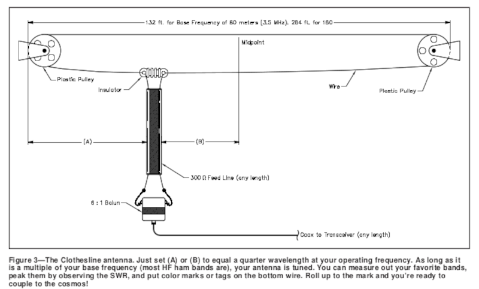
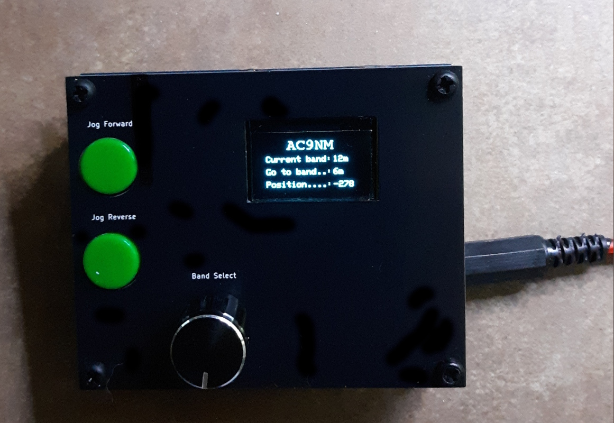
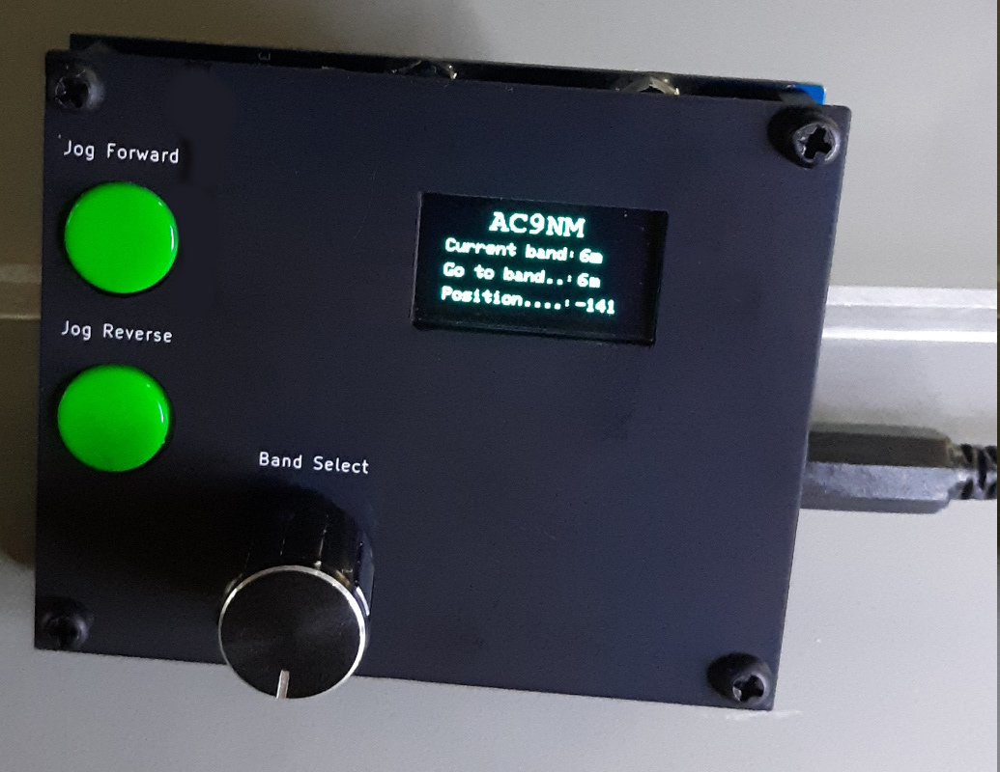
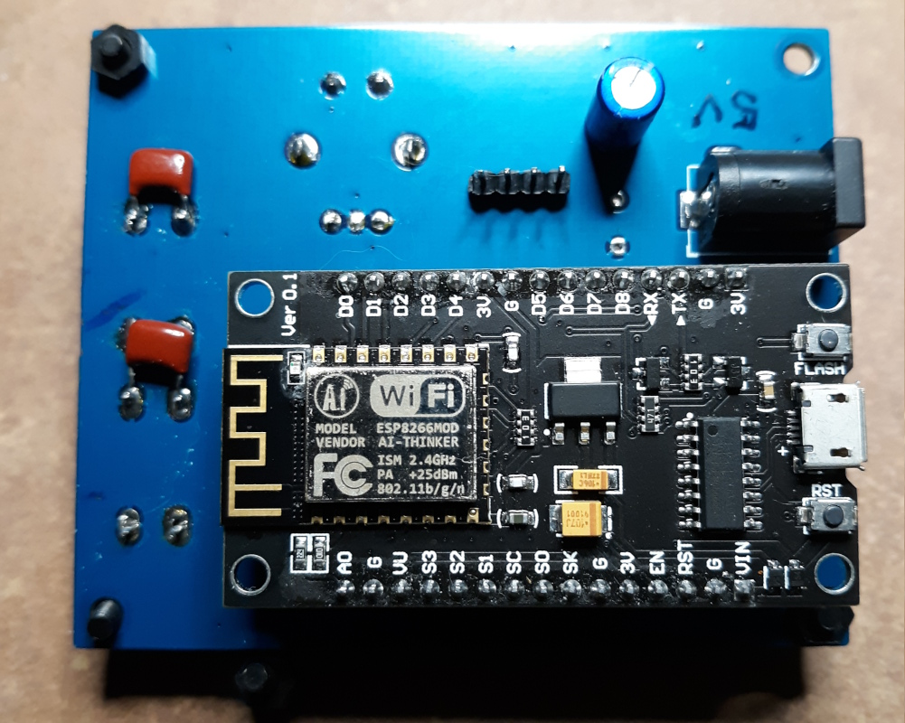
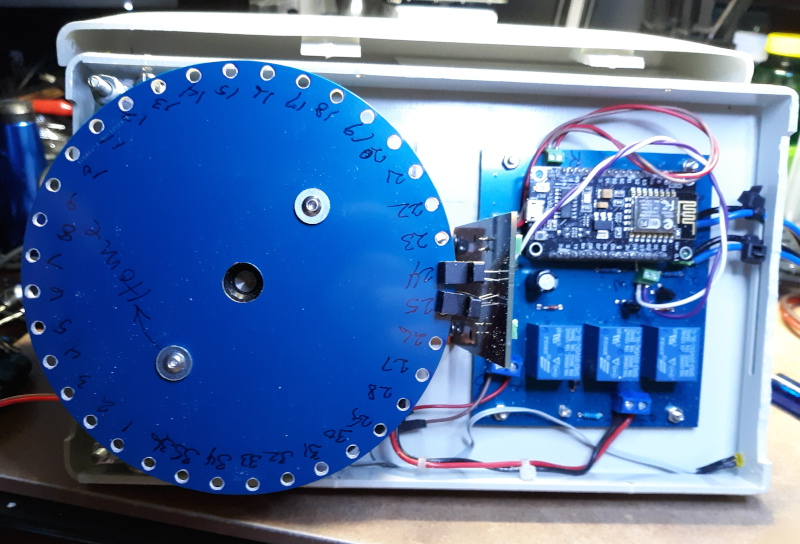
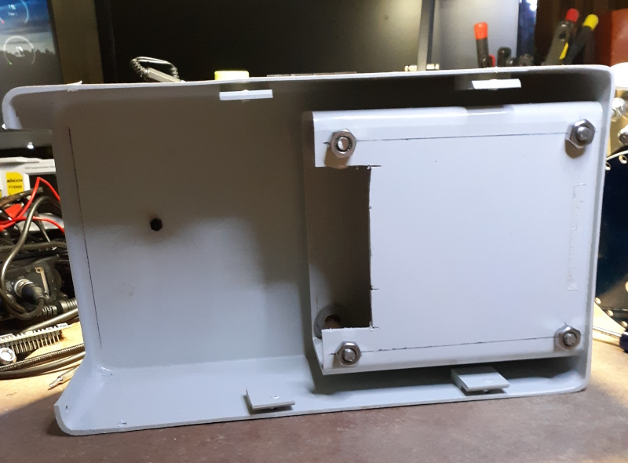
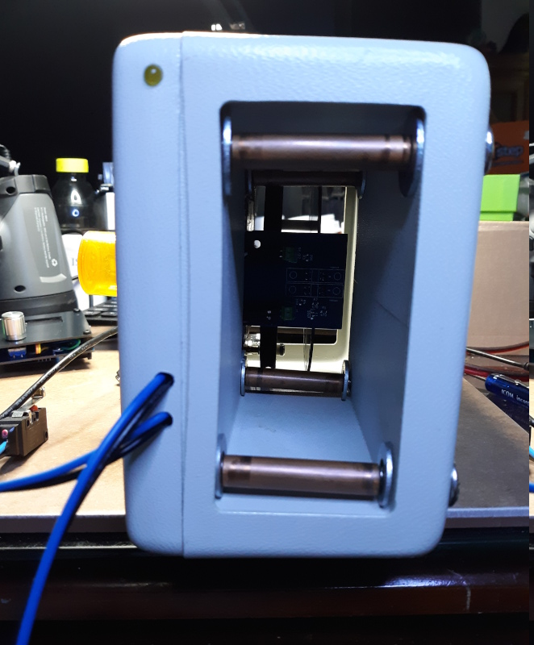
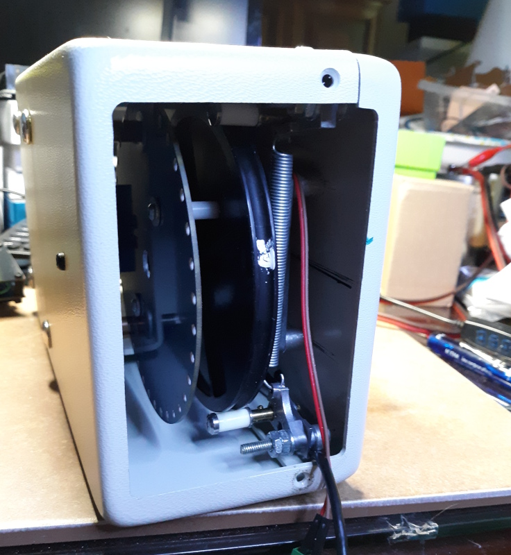
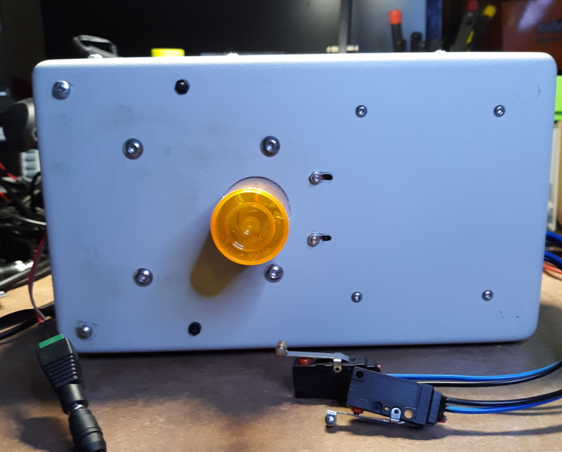

# A Motorized Remote Controlled Clothesline Antenna for the HAM HF Bands 

The basic layout of the clothsline antenna is shown in figure 3 above as described by By Robert Victor, VA2ERY, in his July 1998 QST article, "The Clothseline Antenna". Basically you move the feedpoint to match the antenna to the transceiver rather than trying to match the tranceiver to the antenna using a antenna tuner. I've made a few changes such as using 450 Ohm ladder line to the shack instead of the 300 Ohm twinleed. I'm using a 1:4 balbal in combination with a 1:1 current balun instead of the 6:1 balun shown. These transformers are built according to instructions from TRX Lab videos on Youtube and work very well. I'll be using short runs of 75 Ohm coax from my Kenwood TS-520 and TS-820 tranceivers. The TS-520/820's manual notes that it can effectively transfer power with an antenna system that results in an input impedance between 15 and 200 ohms.

### Remote and Motor Control
The remote and motor control use NodeMCU 1.0 ESP-8266 dev modules. The motor control uses a DIY rotary encoder using a PCB 120mm diameter disk with 36 apertures, a pair of photo interruptors,  and a 12V 45 RPM gear motor which I found at the Surplus Center. The Surplus Center has about 780 of these gear motors still in stock for $9.95 each as of October 2025. The remote control uses a rotary encoder to select a band and pressing the encoder button causes the motor control to move the antenna to a predetermined position. There are jog forward and jog backward buttons to allow fine tuning the antenna position. Once set, the position is remembered even if power is lost. The Motor Control can be reprogrammed wirelessly by saving its Arduino sketch as a binary file and then uploading the bin file using a web browser. 

You'll also need silicon covered #12 AWG wire with a high strand count which gives it its flexability. Mine is about 4.5mm in diameter and has about 100 strands. I don't have a source for the wire as I bought 300 feet of of this wire from a vendor on Aliexpress about five years ago.

The zip file contains all the information and files needed to build a clothesline antenna. Included are the Arduino sketches, KiCAD (V9.x) PCB layout files for the boards and rotor disk. Gerber zip files are in the production subfolders for sending to a PCB board maker. There's a KiCAD pcbnew plugin I use to produce Gerbers for JLPCB fabrication but these should be suitable for other fab houses as well. 

https://www.kicad.org

You'll also need some type of box to mount the rotary encoder/NodeMCU in and feed it with 12V power. I'm using a case from a 1990's hard drive enclosure and a 12V 5A AC power adapter. 

The remote control uses a low power 5v supply. Barrel jacks are used on both devices.

I'll be putting the antenna up this fall on a 40 foot flag pole. So more info on how it actually performs will be comming soon. In the meantime, here are some photos of the remote control and motor control.

                                          <ins>Photos</ins>

#### Remote:

Front panel is made from a PCB. 80mm x 65mm (3.14" x 2.56")

The SSD1306 OLED is held in place using plastic standoffs that are epoxied to the pcb. 

#### Motor Control with Rotary Encoder:

The TCST2103-photo interrupter detectors used as a quadrature position encoder. The detector PCB is mounted using an L-bracket.

Front (antenna exit) side. Copper tubing is used as rollers on 1/4 inch SS carriage bolts. 

Back of rotary encoder housing showing the encoder disk mounted to the drive pully with 20mm nylon standoffs. The white mark on the pully is there so I can count the revolutions per band. The pinch rollers are from an old VCR. The opening will get a plastic cover.

The gear motor sticks out of the case but is waterproofed with a pill bottle. Next to the pill bottle are the adjustment slots for positioning the photo interrupter detectors.
The two waterproof limit switches are shown in the foreground. They will be mounted on the front. Disks on the antenna wire will activate the switches to stop the gearmotor if it goes too far or to signal when the home position is reached.

